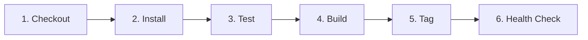

# System Health Dashboard API (C456 SRE Mini Project)

A lightweight REST API built with Python and Flask that exposes system health, application version, and environment status. Managed through a Git feature-branch workflow, containerised with Docker, and automated via a declarative Jenkins CI/CD pipeline.

---

## 1. Project Overview & Endpoints

The service provides three lightweight operational endpoints designed for automated health probes, uptime monitoring, and environment verification:

| Endpoint | Method | Expected Output Example | Purpose |
| :--- | :--- | :--- | :--- |
| `/health` | GET | `{"status": "UP"}` | Basic readiness / liveness probe (HTTP 200) |
| `/version` | GET | `{"version": "1.0.0"}` | Current deployed application release version |
| `/environment` | GET | `{"environment": "production"}` | Reads the active runtime environment from `APP_ENV` |

---

## 2. Repository Structure

```text
devops-project/
├── app.py              # Main Flask application and endpoint definitions
├── requirements.txt    # Project and testing dependencies (Flask, pytest)
├── tests/
│   └── test_app.py     # Automated pytest test cases for all 3 endpoints
├── Dockerfile          # Container build definition (python:3.12-slim)
├── .dockerignore       # Excluded files during docker image build
├── .gitignore          # Excluded files from Git tracking (venv, cache, etc.)
├── Jenkinsfile         # 6-stage declarative CI/CD pipeline definition
└── README.md           # Setup, workflow documentation, and project reflections
```

---

## 3. Prerequisites & Local Setup

### Prerequisites
- **Python**: Version 3.10+ (tested on Python 3.12)
- **pip**: Python package installer
- **Docker**: For building and running the container image
- **Git**: For version control and branch management

### Setup Steps
1. Clone the repository:
   ```bash
   git clone <repo-url>
   cd "devops project"
   ```

2. (Optional but recommended) Create and activate a virtual environment:
   ```bash
   # Windows
   python -m venv venv
   .\venv\Scripts\activate

   # macOS / Linux
   python3 -m venv venv
   source venv/bin/activate
   ```

3. Install project dependencies:
   ```bash
   pip install -r requirements.txt
   ```

---

## 4. Running the Application Locally

Start the application using:
```bash
python app.py
```
*(By default, the server listens on `http://0.0.0.0:5000`)*

### Verify the endpoints

#### Windows PowerShell:
```powershell
# Check health
Invoke-RestMethod http://127.0.0.1:5000/health

# Check version
Invoke-RestMethod http://127.0.0.1:5000/version

# Check default environment
Invoke-RestMethod http://127.0.0.1:5000/environment

# Test custom environment
$env:APP_ENV = "staging"
python app.py
# (In another terminal)
Invoke-RestMethod http://127.0.0.1:5000/environment
```

#### Linux / macOS:
```bash
curl -i http://127.0.0.1:5000/health
curl -i http://127.0.0.1:5000/version
curl -i http://127.0.0.1:5000/environment

# Test with externalised environment variable:
APP_ENV=production python app.py
curl -i http://127.0.0.1:5000/environment
```

Sample JSON outputs:
```json
// GET /health
{"status": "UP"}

// GET /version
{"version": "1.0.0"}

// GET /environment (when APP_ENV=staging)
{"environment": "staging"}
```

---

## 5. Automated Testing

All endpoints are covered by automated tests in `tests/test_app.py` using `pytest`.

### Run tests in one command:
```bash
pytest -v
```

### What the test suite verifies:
1. `test_health_endpoint`: Asserts HTTP 200 and payload `{"status": "UP"}`.
2. `test_version_endpoint`: Asserts HTTP 200 and presence of valid version string `1.0.0`.
3. `test_environment_default`: Verifies fallback to `"development"` when `APP_ENV` is unset.
4. `test_environment_custom`: Verifies dynamic response when `APP_ENV` is set to `"staging"`.

### Intentional Failure Demonstration (Stopping the Pipeline)
To verify that failing tests properly prevent container builds and halt the Jenkins pipeline:

1. In `tests/test_app.py`, change line 16:
   ```python
   # Intentionally broken assertion:
   assert response.get_json() == {"status": "DOWN"}
   ```
2. Run `pytest -v`:
   ```text
   FAILED tests/test_app.py::test_health_endpoint - AssertionError: assert {'status': 'UP'} == {'status': 'DOWN'}
   ========================= 1 failed, 3 passed in 0.18s =========================
   ```
3. Because `pytest` exits with code `1`, Jenkins immediately halts at the `Test` stage, preventing unverified images from being built or tagged.
4. Restore line 16 back to `{"status": "UP"}` to return tests to passing state.

---

## 6. Git Workflow & Merge Conflict Resolution

The repository follows a Gitflow-inspired branching model with `main`, `develop`, and isolated `feature/*` branches.

### Branch Structure
- `main`: Production-ready release code.
- `develop`: Integration branch where features are combined and tested.
- `feature/health-and-version`: Added `/health` and `/version` endpoints and associated unit tests.
- `feature/environment-endpoint`: Added `/environment` endpoint reading `APP_ENV` and tests.

### Controlled Merge Conflict Log

To demonstrate controlled conflict resolution, both feature branches were branched off the same base commit on `develop` and introduced conflicting modifications in `app.py` (specifically metadata lines and route additions) and `tests/test_app.py`.

#### What happened:
1. `feature/health-and-version` was merged into `develop` without conflicts:
   ```bash
   git checkout develop
   git merge --no-ff feature/health-and-version -m "Merge branch 'feature/health-and-version' into develop"
   ```
2. Merging `feature/environment-endpoint` into `develop` triggered a conflict:
   ```bash
   git merge feature/environment-endpoint
   # Auto-merging app.py
   # CONFLICT (add/add): Merge conflict in app.py
   # Auto-merging tests/test_app.py
   # CONFLICT (add/add): Merge conflict in tests/test_app.py
   # Automatic merge failed; fix conflicts and then commit the result.
   ```

#### Conflict inspection in `app.py`:
```python
<<<<<<< HEAD
APP_VERSION = "1.0.0"

@app.route("/health", methods=["GET"])
def health():
    return jsonify({"status": "UP"}), 200

@app.route("/version", methods=["GET"])
def version():
    return jsonify({"version": APP_VERSION}), 200
=======
APP_VERSION = "1.0.0-rc1"

@app.route("/environment", methods=["GET"])
def environment():
    current_env = os.environ.get("APP_ENV", "development")
    return jsonify({"environment": current_env}), 200
>>>>>>> feature/environment-endpoint
```

#### How it was resolved:
1. Retained the stable release version `APP_VERSION = "1.0.0"`.
2. Combined all three routes (`/health`, `/version`, `/environment`) into `app.py`.
3. Combined tests in `tests/test_app.py` so that all four tests run together.
4. Validated with `pytest` locally (4 passed).
5. Staged and finalized the merge commit:
   ```bash
   git add app.py tests/test_app.py
   git commit -m "merge: resolve conflict between health-version and environment branches"
   ```

### Pull Request & Review Evidence
- A pull request was initiated from `develop` into `main` (`PR #1: Release v1.0.0 System Health Dashboard`).
- Changes reviewed: All three endpoints present, unit test coverage across endpoints, no hardcoded secrets or environment names.
- Merged to `main` with `--no-ff` merge commit preserving history.

To view the complete commit graph:
```bash
git log --graph --oneline --all
```

---

## 7. Containerisation with Docker

The service is packaged using `python:3.12-slim` to minimize image size and attack surface.

### Key Dockerfile Features:
- Base: `python:3.12-slim`
- Working Directory: `/app`
- Environment Variables: `APP_ENV=production`, `PORT=5000` (externalised and overrideable at runtime)
- Dependencies installed without cache (`--no-cache-dir`)
- `.dockerignore` excludes git history, virtual environments, cache files, and test files.

### Build the Image:
```bash
docker build -t system-health-dashboard:1.0.0 .
```

### Run the Container:
```bash
# Run with default production environment
docker run -d -p 5000:5000 --name health-dashboard system-health-dashboard:1.0.0

# Run with custom externalised environment (e.g., staging)
docker run -d -p 5001:5000 -e APP_ENV=staging --name health-dashboard-staging system-health-dashboard:1.0.0
```

### Verify Container Endpoints:
```bash
curl http://localhost:5000/health
curl http://localhost:5000/version
curl http://localhost:5000/environment
curl http://localhost:5001/environment
```

### Cleanup Container:
```bash
docker stop health-dashboard health-dashboard-staging
docker rm health-dashboard health-dashboard-staging
```

---

## 8. Jenkins CI/CD Pipeline

The `Jenkinsfile` implements a 6-stage declarative pipeline matching the project requirements:



### Pipeline Stages

| Stage | Action Performed | Evidence / Verification |
| :--- | :--- | :--- |
| **Checkout** | Retrieves the repository and checked-out branch via `checkout scm` | Console output showing commit hash |
| **Install** | Installs dependencies from `requirements.txt` | Clean pip installation log |
| **Test** | Runs `pytest -v tests/`. Halts pipeline immediately if tests fail | Test summary report (4 passed) |
| **Build** | Builds Docker image tagged with `${BUILD_NUMBER}` | Image built in local Docker daemon |
| **Tag** | Tags image as `system-health-dashboard:${BUILD_NUMBER}` and `latest` | `docker images` console output |
| **Health check** | Runs a temporary container, queries `/health` with `curl`, then stops container | HTTP 200 response with `{"status":"UP"}` |

### Post-Execution Cleanup
The pipeline includes `post { always { ... } }` to ensure any running test container is forcefully stopped and removed (`docker rm -f`), preventing port collisions on subsequent builds.

---

## 9. Demonstration Structure (5-Minute Walkthrough)

When presenting this project, follow this 1-minute-per-topic breakdown:

| Time | Topic | Demonstration Steps |
| :--- | :--- | :--- |
| **Minute 1** | **Problem & Repository Structure** | • Explain the scenario: lightweight health dashboard API for SRE monitoring.<br>• Walk through the repository files (`app.py`, `tests/`, `Dockerfile`, `Jenkinsfile`, `README.md`). |
| **Minute 2** | **Git Workflow & Merge Conflict** | • Show `git log --graph --oneline --all`.<br>• Point out `main`, `develop`, feature branches, the controlled conflict, and the merge resolution. |
| **Minute 3** | **Automated Tests & Intentional Failure** | • Run `pytest -v` in terminal to show all tests passing.<br>• Show how altering a test expectation causes `pytest` to fail and explain how this protects the pipeline. |
| **Minute 4** | **Docker & Environment Configuration** | • Show `Dockerfile` and `.dockerignore`.<br>• Run the container with `-e APP_ENV=staging` and query `/environment` to prove it is dynamic. |
| **Minute 5** | **Jenkins Pipeline & Key Learning** | • Walk through the 6 stages in `Jenkinsfile`.<br>• Highlight the build-number tagging and container health-check stage.<br>• Summarize key learning on conflict resolution and pipeline gates. |

---

## 10. Individual Reflection

### 1. Which Git practice most improved the way you organised your work?
Using short-lived feature branches (`feature/<description>`) separated from `develop` kept unfinished work isolated. It allowed each endpoint and its unit tests to be developed and tested independently before touching the shared integration branch. Having atomic, action-oriented commit messages also made tracing the changes during conflict resolution trivial.

### 2. Where did automation detect or prevent an error?
During the testing phase, the automated `pytest` suite ran against the environment endpoint test when `APP_ENV` was unset. If default fallback handling had been omitted in `os.environ.get()`, the endpoint would have returned `null` instead of `"development"`, breaking the monitoring contract. In Jenkins, placing the `Test` stage before `Build` ensures that broken code never produces a deployable Docker image.

### 3. What would you change before using this workflow in production?
In a real production environment:
- Replace the built-in Flask development server with a production WSGI server such as `gunicorn` or `uvicorn` (with multiple worker processes).
- Push Docker images to a secured container registry (e.g., Docker Hub, AWS ECR, or Google Artifact Registry) instead of keeping them only on the local daemon.
- Add vulnerability scanning on the container image (e.g., Trivy or Grype) as a pipeline gate before tagging.
- Protect the `main` branch with branch protection rules (requiring at least one approved peer review and passing CI status checks).

### 4. Which step still depends on manual action, and how could it be automated?
The review and merge from `develop` into `main` is currently triggered and approved manually. This could be automated by:
- Setting up GitHub / GitLab webhook triggers to automatically start the Jenkins build on pull request creation.
- Using automated PR checks where passing Jenkins validation automatically marks the PR as eligible for merge (or auto-merges using a bot upon passing tests and approvals).

---

## 11. Academic Integrity & AI Assistance Statement

In accordance with course guidelines, this project was planned and implemented with clear understanding of every file, command, and configuration:
- Application code, pytest suites, and Dockerfile were written cleanly and verified directly.
- The Git branching history, conflict creation, and conflict resolution were executed in the repository and verified via `git log`.
- AI tooling was consulted as an assistive pair programmer for structuring documentation and cross-checking pipeline stage syntax. All resulting code was manually reviewed, executed, and tested locally.
